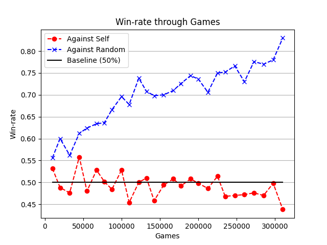

# RungRL - RL Agents for the card game Rung 

This repo contains different kinds of RL agents for Rung which is more commonly known as
[Court Piece](https://en.wikipedia.org/wiki/Court_piece). Court Piece or Rung (as referred to by this repo) is a classic
4 player card game. You can read more about the rules of the game on Wikipedia. But the interesting thing to note is
that there are two teams in the game. Players facing each other are partners and they have to collaborate with each
other to win the game without knowing the other player's cards and without exchanging any information.

This aspect made it interesting to make this project a reality. The main motivation for this project was to answer the
question if modern RL algorithms are capable enough (and if yes, how much) to solve such kind of problem. The repo was
not created to be used a library. Hence, there should be a very few endpoint to consume this repo in other tasks. But
within the context of the objective of the code, it is fairly customizable and easy-to-use. You can also extend by
implementing more agents in `rung_rl.agents` package etc.

But if you want to just run the training locally as-is, look at the training scripts like
[`train.py`](training_scripts/train_dqn.py) in [`training_scripts/`](training_scripts). More information on training is
given in a subsequent section.

Here is an example of how to play a game against a random agent

## Playing against 3 random agents

```python
from rung_rl.agents.random_agent import RandomAgent
from rung_rl.agents.human_agent import HumanAgent
from rung_rl.rung import Game

# setup the players
players = [HumanAgent(0), RandomAgent(), RandomAgent(), RandomAgent()]

# setup the game
game = Game(players)
game.initialize()

# start the game
game.play_game()

# follow the output on the console to act as a human agent in the game to play
```

## Alogrithms implemented

* Deep Q Learning [DQN](rung_rl/agents/dqn/dqn_agent.py)
* Deep Recursive Q Learning [DRQN](rung_rl/agents/dqn/dqn_agent.py)
* Advantage Actor-Critic [A2C](rung_rl/agents/a2c/a2c_agent.py)
* Proximal Policy Optimization [PPO](rung_rl/agents/ppo/ppo_agent.py)

## Results

The results were fascinating. Altough, there is a need for more benchmarking since there has been no benchmarking
against Human players on scale. Such benchmarking would need an interactive UI which is the next steps in the
development. Currently, all the benchmarking is against Random agents. The best model was DRQN which consistently
achieved a win rate of around 85% against random agents.

### Win rate against Random agents DRQN: Binary rewards



Other evaluation graphs are present in `saved_models` directory.

## Playing against (pre trained) DRQN Agent

If you want to play a game against 3 pre-trained DRQN agents. You can use path of any of the saved models present in
the `saved_model` directory such as `saved_models/dqn_best_recurrent/model_dqn_final`
and run the game using the endpoints described before. Such as:

```python
from rung_rl.agents.dqn.dqn_agent import DQNAgent
from rung_rl.agents.human_agent import HumanAgent
from rung_rl.rung import Game

agent = DQNAgent()  # create a DQN agent
agent.load_model_from_path("saved_models/dqn_best_recurrent/model_dqn_final")  # load the pre-trained model 
agent.eval = True  # run the agent in evaluation mode (make the best moves)

# setup the players
players = [agent, HumanAgent(1), agent, agent]  # set every other player to the loaded DQN agent

# setup the game
game = Game(players)
game.initialize()
game.play_game()

# follow the inputs from the human agent to play the game. 

```

## Training locally

If you just want to train. There are pre-written training scripts that have been used for the experimentation done
already. You would ideally just have to execute [`train.py`](training_scripts/train_dqn.py) and the training would start.
Make sure you create a local folder named `models` in the `training_scripts` directory for storing the model
checkpoints. If you want to change the parameters of the agents. You can do so in the agent(s) class files. Such as
[`dqn_agent.py`](rung_rl/agents/dqn/dqn_agent.py)

## Future Work

* Implement PPO and evaluate on large scale
* Create an interactive front-end which can be used for human evaluation
* Come up with a better strategy to encode cards and hands an available actions

```